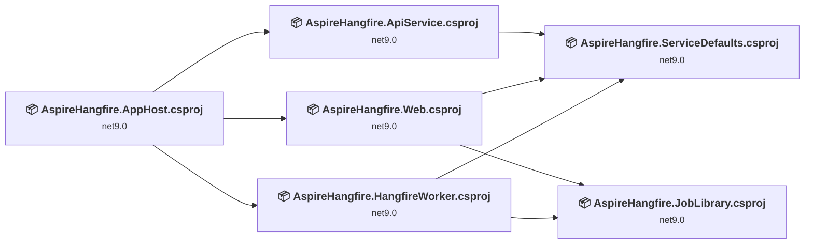
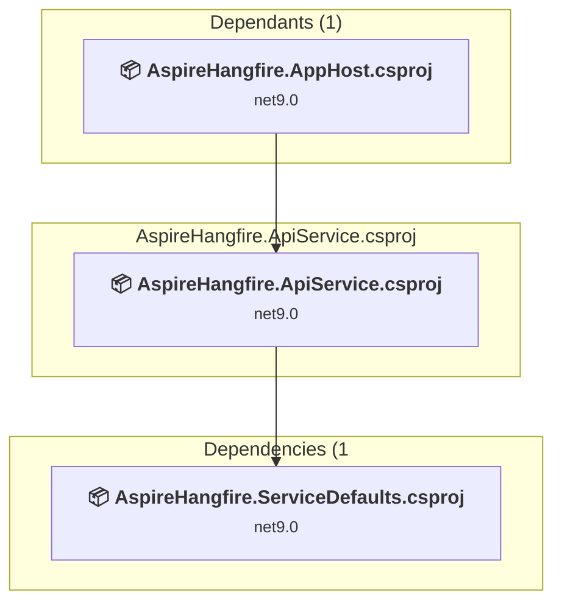
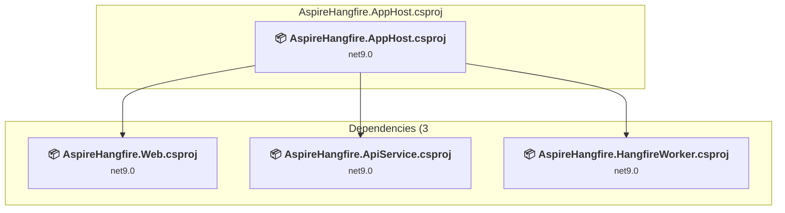
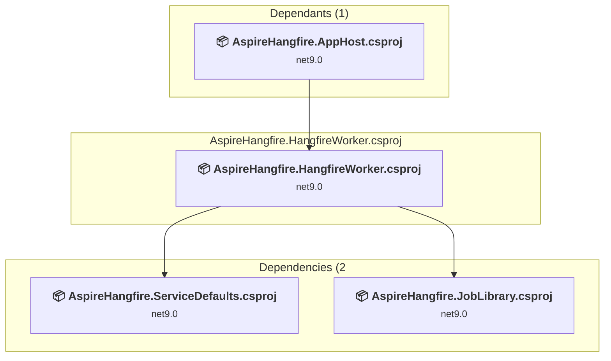
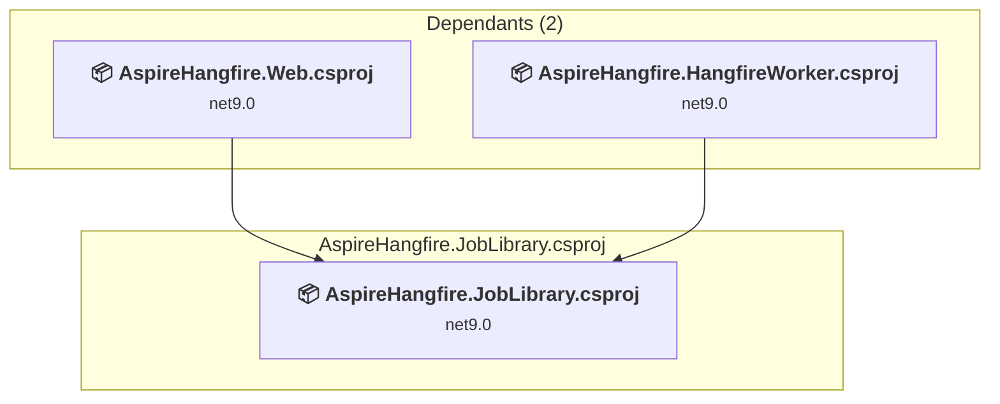
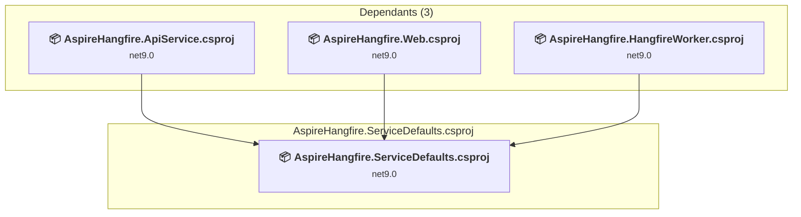
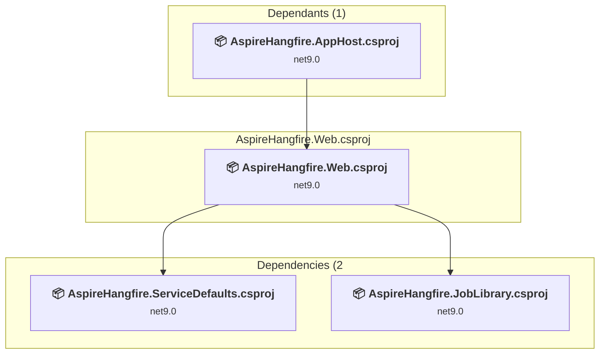

# Projects and dependencies analysis

This document provides a comprehensive overview of the projects and their dependencies in the context of upgrading to .NETCoreApp,Version=v10.0.

## Table of Contents

- [Executive Summary](#executive-Summary)
  - [Highlevel Metrics](#highlevel-metrics)
  - [Projects Compatibility](#projects-compatibility)
  - [Package Compatibility](#package-compatibility)
  - [API Compatibility](#api-compatibility)
- [Aggregate NuGet packages details](#aggregate-nuget-packages-details)
- [Top API Migration Challenges](#top-api-migration-challenges)
  - [Technologies and Features](#technologies-and-features)
  - [Most Frequent API Issues](#most-frequent-api-issues)
- [Projects Relationship Graph](#projects-relationship-graph)
- [Project Details](#project-details)

  - [AspireHangfire.ApiService\AspireHangfire.ApiService.csproj](#aspirehangfireapiserviceaspirehangfireapiservicecsproj)
  - [AspireHangfire.AppHost\AspireHangfire.AppHost.csproj](#aspirehangfireapphostaspirehangfireapphostcsproj)
  - [AspireHangfire.HangfireWorker\AspireHangfire.HangfireWorker.csproj](#aspirehangfirehangfireworkeraspirehangfirehangfireworkercsproj)
  - [AspireHangfire.JobLibrary\AspireHangfire.JobLibrary.csproj](#aspirehangfirejoblibraryaspirehangfirejoblibrarycsproj)
  - [AspireHangfire.ServiceDefaults\AspireHangfire.ServiceDefaults.csproj](#aspirehangfireservicedefaultsaspirehangfireservicedefaultscsproj)
  - [AspireHangfire.Web\AspireHangfire.Web.csproj](#aspirehangfirewebaspirehangfirewebcsproj)

## Executive Summary

### Highlevel Metrics

| Metric | Count | Status |
| :--- | :---: | :--- |
| Total Projects | 6 | All require upgrade |
| Total NuGet Packages | 17 | 5 need upgrade |
| Total Code Files | 9 |  |
| Total Code Files with Incidents | 8 |  |
| Total Lines of Code | 405 |  |
| Total Number of Issues | 16 |  |
| Estimated LOC to modify | 5+ | at least 1.2% of codebase |

### Projects Compatibility

| Project | Target Framework | Difficulty | Package Issues | API Issues | Est. LOC Impact | Description |
| :--- | :---: | :---: | :---: | :---: | :---: | :--- |
| [AspireHangfire.ApiService\AspireHangfire.ApiService.csproj](#aspirehangfireapiserviceaspirehangfireapiservicecsproj) | net9.0 | 🟢 Low | 1 | 1 | 1+ | AspNetCore, Sdk Style = True |
| [AspireHangfire.AppHost\AspireHangfire.AppHost.csproj](#aspirehangfireapphostaspirehangfireapphostcsproj) | net9.0 | 🟢 Low | 0 | 0 |  | DotNetCoreApp, Sdk Style = True |
| [AspireHangfire.HangfireWorker\AspireHangfire.HangfireWorker.csproj](#aspirehangfirehangfireworkeraspirehangfirehangfireworkercsproj) | net9.0 | 🟢 Low | 1 | 0 |  | DotNetCoreApp, Sdk Style = True |
| [AspireHangfire.JobLibrary\AspireHangfire.JobLibrary.csproj](#aspirehangfirejoblibraryaspirehangfirejoblibrarycsproj) | net9.0 | 🟢 Low | 1 | 0 |  | ClassLibrary, Sdk Style = True |
| [AspireHangfire.ServiceDefaults\AspireHangfire.ServiceDefaults.csproj](#aspirehangfireservicedefaultsaspirehangfireservicedefaultscsproj) | net9.0 | 🟢 Low | 2 | 0 |  | ClassLibrary, Sdk Style = True |
| [AspireHangfire.Web\AspireHangfire.Web.csproj](#aspirehangfirewebaspirehangfirewebcsproj) | net9.0 | 🟢 Low | 0 | 4 | 4+ | AspNetCore, Sdk Style = True |

### Package Compatibility

| Status | Count | Percentage |
| :--- | :---: | :---: |
| ✅ Compatible | 12 | 70.6% |
| ⚠️ Incompatible | 0 | 0.0% |
| 🔄 Upgrade Recommended | 5 | 29.4% |
| ***Total NuGet Packages*** | ***17*** | ***100%*** |

### API Compatibility

| Category | Count | Impact |
| :--- | :---: | :--- |
| 🔴 Binary Incompatible | 0 | High - Require code changes |
| 🟡 Source Incompatible | 0 | Medium - Needs re-compilation and potential conflicting API error fixing |
| 🔵 Behavioral change | 5 | Low - Behavioral changes that may require testing at runtime |
| ✅ Compatible | 1060 |  |
| ***Total APIs Analyzed*** | ***1065*** |  |

## Aggregate NuGet packages details

| Package | Current Version | Suggested Version | Projects | Description |
| :--- | :---: | :---: | :--- | :--- |
| Aspire.Hosting.AppHost | 13.1.0 |  | [AspireHangfire.AppHost.csproj](#aspirehangfireapphostaspirehangfireapphostcsproj) | ✅Compatible |
| Aspire.Hosting.Docker | 9.5.2-preview.1.25522.3 |  | [AspireHangfire.AppHost.csproj](#aspirehangfireapphostaspirehangfireapphostcsproj) | ✅Compatible |
| Aspire.Hosting.Redis | 13.1.0 |  | [AspireHangfire.AppHost.csproj](#aspirehangfireapphostaspirehangfireapphostcsproj) | ✅Compatible |
| Aspire.StackExchange.Redis.OutputCaching | 13.1.0 |  | [AspireHangfire.Web.csproj](#aspirehangfirewebaspirehangfirewebcsproj) | ✅Compatible |
| Hangfire.AspNetCore | 1.8.21 |  | [AspireHangfire.Web.csproj](#aspirehangfirewebaspirehangfirewebcsproj) | ✅Compatible |
| Hangfire.NetCore | 1.8.21 |  | [AspireHangfire.HangfireWorker.csproj](#aspirehangfirehangfireworkeraspirehangfirehangfireworkercsproj) | ✅Compatible |
| Hangfire.Redis.StackExchange | 1.12.0 |  | [AspireHangfire.HangfireWorker.csproj](#aspirehangfirehangfireworkeraspirehangfirehangfireworkercsproj) [AspireHangfire.Web.csproj](#aspirehangfirewebaspirehangfirewebcsproj) | ✅Compatible |
| Microsoft.AspNetCore.OpenApi | 9.0.12 | 10.0.2 | [AspireHangfire.ApiService.csproj](#aspirehangfireapiserviceaspirehangfireapiservicecsproj) | NuGet package upgrade is recommended |
| Microsoft.Extensions.Hosting | 9.0.12 | 10.0.2 | [AspireHangfire.HangfireWorker.csproj](#aspirehangfirehangfireworkeraspirehangfirehangfireworkercsproj) | NuGet package upgrade is recommended |
| Microsoft.Extensions.Http.Resilience | 9.9.0 | 10.2.0 | [AspireHangfire.ServiceDefaults.csproj](#aspirehangfireservicedefaultsaspirehangfireservicedefaultscsproj) | NuGet package upgrade is recommended |
| Microsoft.Extensions.Logging.Abstractions | 9.0.12 | 10.0.2 | [AspireHangfire.JobLibrary.csproj](#aspirehangfirejoblibraryaspirehangfirejoblibrarycsproj) | NuGet package upgrade is recommended |
| Microsoft.Extensions.ServiceDiscovery | 9.5.2 | 10.2.0 | [AspireHangfire.ServiceDefaults.csproj](#aspirehangfireservicedefaultsaspirehangfireservicedefaultscsproj) | NuGet package upgrade is recommended |
| OpenTelemetry.Exporter.OpenTelemetryProtocol | 1.15.0 |  | [AspireHangfire.ServiceDefaults.csproj](#aspirehangfireservicedefaultsaspirehangfireservicedefaultscsproj) | ✅Compatible |
| OpenTelemetry.Extensions.Hosting | 1.15.0 |  | [AspireHangfire.ServiceDefaults.csproj](#aspirehangfireservicedefaultsaspirehangfireservicedefaultscsproj) | ✅Compatible |
| OpenTelemetry.Instrumentation.AspNetCore | 1.15.0 |  | [AspireHangfire.ServiceDefaults.csproj](#aspirehangfireservicedefaultsaspirehangfireservicedefaultscsproj) | ✅Compatible |
| OpenTelemetry.Instrumentation.Http | 1.15.0 |  | [AspireHangfire.ServiceDefaults.csproj](#aspirehangfireservicedefaultsaspirehangfireservicedefaultscsproj) | ✅Compatible |
| OpenTelemetry.Instrumentation.Runtime | 1.15.0 |  | [AspireHangfire.ServiceDefaults.csproj](#aspirehangfireservicedefaultsaspirehangfireservicedefaultscsproj) | ✅Compatible |

## Top API Migration Challenges

### Technologies and Features

| Technology | Issues | Percentage | Migration Path |
| :--- | :---: | :---: | :--- |

### Most Frequent API Issues

| API | Count | Percentage | Category |
| :--- | :---: | :---: | :--- |
| T:System.Uri | 2 | 40.0% | Behavioral Change |
| M:Microsoft.AspNetCore.Builder.ExceptionHandlerExtensions.UseExceptionHandler(Microsoft.AspNetCore.Builder.IApplicationBuilder) | 1 | 20.0% | Behavioral Change |
| M:Microsoft.AspNetCore.Builder.ExceptionHandlerExtensions.UseExceptionHandler(Microsoft.AspNetCore.Builder.IApplicationBuilder,System.String,System.Boolean) | 1 | 20.0% | Behavioral Change |
| M:System.Uri.#ctor(System.String) | 1 | 20.0% | Behavioral Change |

## Projects Relationship Graph

Legend:
📦 SDK-style project
⚙️ Classic project

## Project Details

### AspireHangfire.ApiService\AspireHangfire.ApiService.csproj

#### Project Info

- **Current Target Framework:** net9.0
- **Proposed Target Framework:** net10.0
- **SDK-style**: True
- **Project Kind:** AspNetCore
- **Dependencies**: 1
- **Dependants**: 1
- **Number of Files**: 3
- **Number of Files with Incidents**: 2
- **Lines of Code**: 45
- **Estimated LOC to modify**: 1+ (at least 2.2% of the project)

#### Dependency Graph

Legend:
📦 SDK-style project
⚙️ Classic project

### API Compatibility

| Category | Count | Impact |
| :--- | :---: | :--- |
| 🔴 Binary Incompatible | 0 | High - Require code changes |
| 🟡 Source Incompatible | 0 | Medium - Needs re-compilation and potential conflicting API error fixing |
| 🔵 Behavioral change | 1 | Low - Behavioral changes that may require testing at runtime |
| ✅ Compatible | 100 |  |
| ***Total APIs Analyzed*** | ***101*** |  |

### AspireHangfire.AppHost\AspireHangfire.AppHost.csproj

#### Project Info

- **Current Target Framework:** net9.0
- **Proposed Target Framework:** net10.0
- **SDK-style**: True
- **Project Kind:** DotNetCoreApp
- **Dependencies**: 3
- **Dependants**: 0
- **Number of Files**: 1
- **Number of Files with Incidents**: 1
- **Lines of Code**: 24
- **Estimated LOC to modify**: 0+ (at least 0.0% of the project)

#### Dependency Graph

Legend:
📦 SDK-style project
⚙️ Classic project

### API Compatibility

| Category | Count | Impact |
| :--- | :---: | :--- |
| 🔴 Binary Incompatible | 0 | High - Require code changes |
| 🟡 Source Incompatible | 0 | Medium - Needs re-compilation and potential conflicting API error fixing |
| 🔵 Behavioral change | 0 | Low - Behavioral changes that may require testing at runtime |
| ✅ Compatible | 76 |  |
| ***Total APIs Analyzed*** | ***76*** |  |

### AspireHangfire.HangfireWorker\AspireHangfire.HangfireWorker.csproj

#### Project Info

- **Current Target Framework:** net9.0
- **Proposed Target Framework:** net10.0
- **SDK-style**: True
- **Project Kind:** DotNetCoreApp
- **Dependencies**: 2
- **Dependants**: 1
- **Number of Files**: 4
- **Number of Files with Incidents**: 1
- **Lines of Code**: 88
- **Estimated LOC to modify**: 0+ (at least 0.0% of the project)

#### Dependency Graph

Legend:
📦 SDK-style project
⚙️ Classic project

### API Compatibility

| Category | Count | Impact |
| :--- | :---: | :--- |
| 🔴 Binary Incompatible | 0 | High - Require code changes |
| 🟡 Source Incompatible | 0 | Medium - Needs re-compilation and potential conflicting API error fixing |
| 🔵 Behavioral change | 0 | Low - Behavioral changes that may require testing at runtime |
| ✅ Compatible | 113 |  |
| ***Total APIs Analyzed*** | ***113*** |  |

### AspireHangfire.JobLibrary\AspireHangfire.JobLibrary.csproj

#### Project Info

- **Current Target Framework:** net9.0
- **Proposed Target Framework:** net10.0
- **SDK-style**: True
- **Project Kind:** ClassLibrary
- **Dependencies**: 0
- **Dependants**: 2
- **Number of Files**: 2
- **Number of Files with Incidents**: 1
- **Lines of Code**: 32
- **Estimated LOC to modify**: 0+ (at least 0.0% of the project)

#### Dependency Graph

Legend:
📦 SDK-style project
⚙️ Classic project

### API Compatibility

| Category | Count | Impact |
| :--- | :---: | :--- |
| 🔴 Binary Incompatible | 0 | High - Require code changes |
| 🟡 Source Incompatible | 0 | Medium - Needs re-compilation and potential conflicting API error fixing |
| 🔵 Behavioral change | 0 | Low - Behavioral changes that may require testing at runtime |
| ✅ Compatible | 14 |  |
| ***Total APIs Analyzed*** | ***14*** |  |

### AspireHangfire.ServiceDefaults\AspireHangfire.ServiceDefaults.csproj

#### Project Info

- **Current Target Framework:** net9.0
- **Proposed Target Framework:** net10.0
- **SDK-style**: True
- **Project Kind:** ClassLibrary
- **Dependencies**: 0
- **Dependants**: 3
- **Number of Files**: 1
- **Number of Files with Incidents**: 1
- **Lines of Code**: 119
- **Estimated LOC to modify**: 0+ (at least 0.0% of the project)

#### Dependency Graph

Legend:
📦 SDK-style project
⚙️ Classic project

### API Compatibility

| Category | Count | Impact |
| :--- | :---: | :--- |
| 🔴 Binary Incompatible | 0 | High - Require code changes |
| 🟡 Source Incompatible | 0 | Medium - Needs re-compilation and potential conflicting API error fixing |
| 🔵 Behavioral change | 0 | Low - Behavioral changes that may require testing at runtime |
| ✅ Compatible | 102 |  |
| ***Total APIs Analyzed*** | ***102*** |  |

### AspireHangfire.Web\AspireHangfire.Web.csproj

#### Project Info

- **Current Target Framework:** net9.0
- **Proposed Target Framework:** net10.0
- **SDK-style**: True
- **Project Kind:** AspNetCore
- **Dependencies**: 2
- **Dependants**: 1
- **Number of Files**: 15
- **Number of Files with Incidents**: 2
- **Lines of Code**: 97
- **Estimated LOC to modify**: 4+ (at least 4.1% of the project)

#### Dependency Graph

Legend:
📦 SDK-style project
⚙️ Classic project

### API Compatibility

| Category | Count | Impact |
| :--- | :---: | :--- |
| 🔴 Binary Incompatible | 0 | High - Require code changes |
| 🟡 Source Incompatible | 0 | Medium - Needs re-compilation and potential conflicting API error fixing |
| 🔵 Behavioral change | 4 | Low - Behavioral changes that may require testing at runtime |
| ✅ Compatible | 655 |  |
| ***Total APIs Analyzed*** | ***659*** |  |

